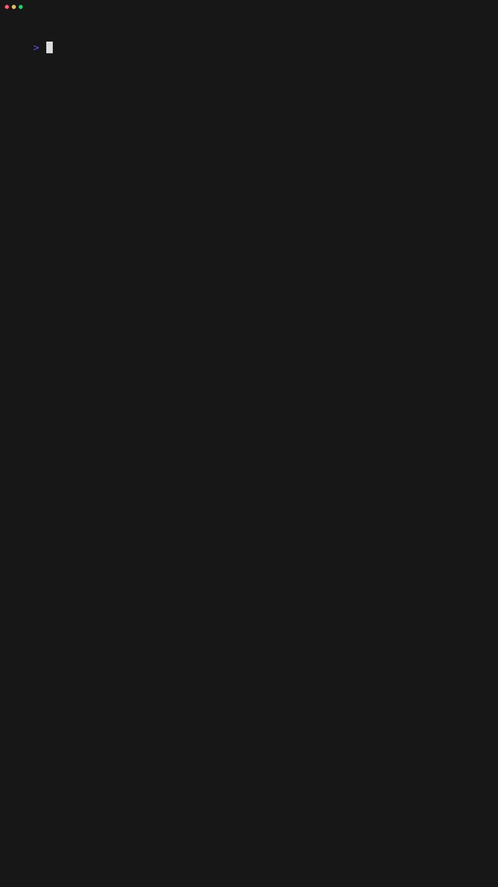
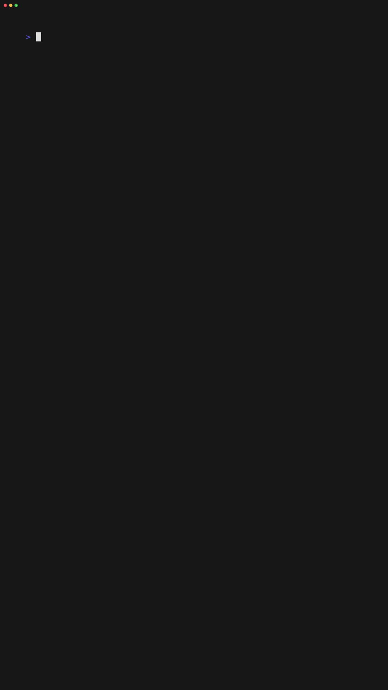
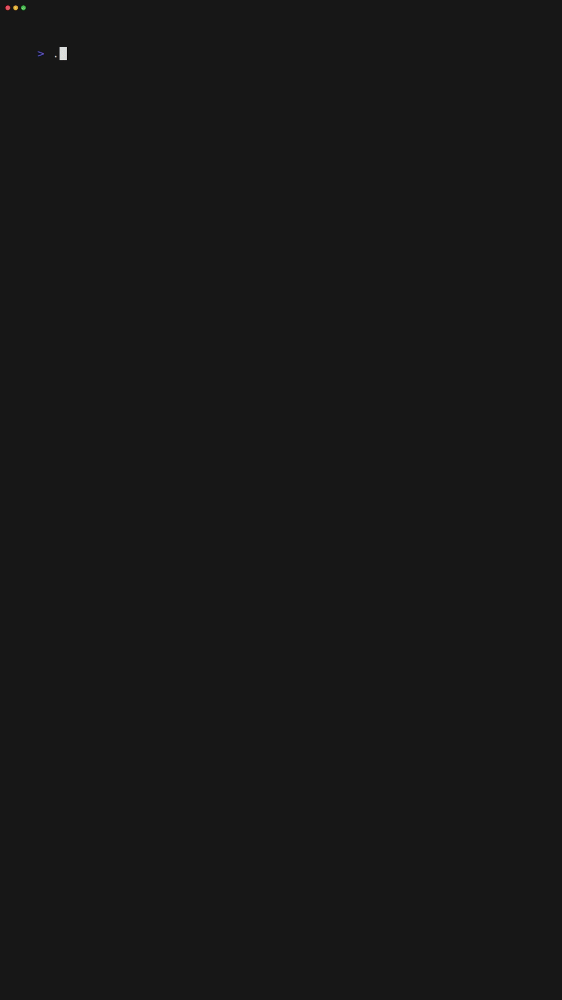

# 🌞 SolarScope CLI - Your Personal Solar System Command Center

[](https://github.blog/open-source/for-the-love-of-code-2025/)
[](https://dotnet.microsoft.com/download/dotnet/9.0)
[](https://spectreconsole.net/)
[](https://spectreconsole.net/cli/)
[](LICENSE)
[](https://www.nuget.org/packages/SolarScope/1.1.0)
**A beautiful, interactive command-line tool for monitoring and analyzing your solar energy system with weather correlations and anomaly detection.**

> Built with ❤️ for GitHub's "For the Love of Code 2025" hackathon - Category 3: Terminal talent
>
## 🧑‍💻 Command Reference

Below are examples of all available commands and their options. Each command supports the global options `--data|-d` (data file path/URL) and `--verbose|-v` (enable verbose output).

### AI Assistant Command

Get help and command suggestions using natural language.

```bash
solarscope ai <prompt> [--model|-m <model>] [--execute|-x] [--data|-d <file>] [--verbose|-v]
```

- `<prompt>` : Natural language question or request
- `--model, -m` : AI model to use (`github/gpt-4o`, `github/o4-mini`) (default: `github/gpt-4o`)
- `--execute, -x` : Execute suggested commands directly (use with caution)
- `--data, -d` : Path or URL to the solar data JSON file
- `--verbose, -v` : Enable verbose output

**Examples:**

```bash
solarscope ai "Show me the dashboard for last 7 days"
solarscope ai "How do I find anomalies with high severity?" 
solarscope ai "What commands are available?" --model github/o4-mini
solarscope ai "Generate a monthly report for 2024" --execute
```

**Note:** Requires a GitHub Personal Access Token with 'models:read' permission set in the `GITHUB_TOKEN` environment variable.

### Dashboard Command

Shows a real-time overview of your solar system.

```bash
solarscope dashboard [--animated|-a] [--full|-f] [--data|-d <file>] [--verbose|-v]
```

- `--animated, -a` : Show animated dashboard
- `--full, -f` : Show full dashboard with all details
- `--data, -d` : Path or URL to the solar data JSON file
- `--verbose, -v` : Enable verbose output

**Examples:**

```bash
solarscope dashboard --animated --full
solarscope dashboard -a -f -d ./data/sample.json --verbose
```

### Analyze Command

Analyze production, weather, anomalies, or correlation data.

```bash
solarscope analyze [--type|-t <type>] [--count|-c <n>] [--data|-d <file>] [--verbose|-v]
```

- `--type, -t` : Type of analysis (`production`, `weather`, `anomalies`, `correlation`)
- `--count, -c` : Number of days/records to analyze (default: 10)
- `--data, -d` : Path or URL to the solar data JSON file
- `--verbose, -v` : Enable verbose output

**Examples:**

```bash
solarscope analyze --type production --count 15
solarscope analyze -t weather -c 20 -d ./data/sample.json
```

### Anomalies Command

Detect and analyze system anomalies.

```bash
solarscope anomalies [--year|-y <year>] [--severity|-s <level>] [--interactive|-i] [--data|-d <file>] [--verbose|-v]
```

- `--year, -y` : Year to analyze (default: latest year in data)
- `--severity, -s` : Minimum anomaly severity (`Low`, `Medium`, `High`)
- `--interactive, -i` : Run in interactive mode
- `--data, -d` : Path or URL to the solar data JSON file
- `--verbose, -v` : Enable verbose output

**Examples:**

```bash
solarscope anomalies --year 2024 --severity High --interactive
solarscope anomalies -y 2023 -s Medium -i -d ./data/sample.json
```

### Report Command

Generate reports for different periods.

```bash
solarscope report [--period <period>] [--year <year>] [--start-day <n>] [--end-day <n>] [--data|-d <file>] [--verbose|-v]
```

- `--period` : Report period (`daily`, `weekly`, `monthly`, `yearly`)
- `--year` : Year to report (optional)
- `--start-day` : Start day for daily report (optional)
- `--end-day` : End day for daily report (optional)
- `--data, -d` : Path or URL to the solar data JSON file
- `--verbose, -v` : Enable verbose output

**Examples:**

```bash
solarscope report --period monthly --year 2024
solarscope report --period daily --start-day 100 --end-day 120 -d ./data/sample.json
```

### Weather Command

Analyze weather and its correlation with solar production.

```bash
solarscope weather [--analysis <type>] [--year <year>] [--data|-d <file>] [--verbose|-v]
```

- `--analysis` : Analysis type (`overview`, `correlation`, `patterns`, `recommendations`)
- `--year` : Year to analyze (optional)
- `--data, -d` : Path or URL to the solar data JSON file
- `--verbose, -v` : Enable verbose output

**Examples:**

```bash
solarscope weather --analysis correlation --year 2024
solarscope weather --analysis patterns -d ./data/sample.json
```

### Explore Command

Interactively explore your solar data.

```bash
solarscope explore [--mode <mode>] [--year <year>] [--data|-d <file>] [--verbose|-v]
```

- `--mode` : Exploration mode (`quick`, `guided`, `full`)
- `--year` : Year to explore (optional)
- `--data, -d` : Path or URL to the solar data JSON file
- `--verbose, -v` : Enable verbose output

**Examples:**

```bash
solarscope explore --mode guided --year 2023
solarscope explore --mode full -d ./data/sample.json
```

### Demo Command

Showcase fun animated demos with different themes and speeds.

```bash
solarscope demo [--theme|-t <theme>] [--speed|-s <speed>] [--data|-d <file>] [--verbose|-v]
```

- `--theme, -t` : Demo theme (`solar`, `matrix`, `rainbow`)
- `--speed, -s` : Animation speed (`slow`, `normal`, `fast`)
- `--data, -d` : Path or URL to the solar data JSON file
- `--verbose, -v` : Enable verbose output

**Examples:**

```bash
solarscope demo --theme matrix --speed fast
solarscope demo -t rainbow -s slow -d ./data/sample.json
```

---

## ✨ Features

### 🎯 Core Functionality

- **AI Assistant** - Natural language command translation and intelligent help with GitHub Models
- **Interactive Dashboard** - Real-time solar system overview with beautiful charts
- **Advanced Analytics** - Production analysis, weather correlation, and trend detection  
- **Anomaly Detection** - Intelligent system monitoring with severity classification
- **Weather Integration** - Correlate weather patterns with energy production
- **Comprehensive Reports** - Monthly, yearly, and custom reporting

### 🎨 Visual Excellence

- **Beautiful Charts** - Bar charts, breakdown charts, and data visualizations
- **Animated Displays** - Dynamic loading, real-time updates, and smooth transitions
- **Multiple Themes** - Solar, Matrix, and Rainbow themes for the demo mode
- **Rich Formatting** - Colors, emojis, panels, and progress indicators
- **Responsive Design** - Adapts to your terminal size and capabilities

### 🚀 Interactive Experience

- **Command-line Interface** - Intuitive commands with comprehensive help
- **Progress Indicators** - Visual feedback for all operations
- **Status Updates** - Real-time processing information
- **Error Handling** - Graceful error messages and suggestions
- **Verbose Mode** - Detailed logging for troubleshooting

## 🏗️ Architecture

### Data Models

- **Rich Data Types** - Comprehensive models for solar, weather, and anomaly data
- **Type Safety** - Full C# record types with JSON serialization
- **Calculated Properties** - Automatic efficiency, balance, and trend calculations
- **Enum Classifications** - Weather conditions, anomaly severity, and wind classifications

### Services Layer

- **Data Service** - Efficient JSON parsing and data access
- **Analytics Engine** - Statistical analysis and correlation calculations
- **Anomaly Detection** - Smart pattern recognition and severity assessment
- **Report Generation** - Flexible reporting with multiple output formats

### Command Architecture

- **Spectre.Console.Cli Pattern** - Each command inherits from `AsyncCommand<TSettings>` and uses a nested `Settings : BaseCommandSettings` class with `[CommandOption]` attributes for arguments
- **Modular Commands** - Separate command classes for each feature
- **Shared Options** - Common base options with command-specific extensions
- **Async Processing** - Non-blocking operations with progress indication
- **Error Recovery** - Comprehensive error handling and user guidance

## 🎮 Demo Modes

### Solar Theme (Default)

- Animated solar system ASCII art
- Energy flow visualizations
- Weather effect simulations
- Production timeline animations

### Matrix Theme

- Digital rain intro sequence
- Green terminal aesthetics
- Glitch effects and system messages
- Cyberpunk data visualization

### Rainbow Theme

- Colorful data presentations
- Animated rainbow effects
- Vibrant charts and indicators
- Celebration animations

## 📊 Sample Data Analysis

The tool analyzes your solar system data including:

- **Daily Production Metrics** - Energy generation, consumption, and grid injection
- **Quarter-hourly Readings** - Detailed 15-minute interval measurements
- **Weather Correlations** - Temperature, precipitation, sunshine, and wind analysis
- **System Anomalies** - Automatic detection of unusual patterns or issues
- **Performance Trends** - Historical analysis and efficiency calculations

## 🛠️ Installation & Setup

### Prerequisites

- .NET 9.0 SDK or later
- Windows, macOS, or Linux
- Terminal with Unicode support (recommended)

### Quick Start

1. **Clone the repository**

  ```bash
  git clone https://github.com/sujithq/super-duper-funicular.git
  cd super-duper-funicular
  ```

2. **Build the project**

  ```bash
  cd src
  dotnet build
  ```

3. **Data Setup**

  SolarScope CLI automatically handles data file setup:
  
- On first run, it creates `SolarScopeData.json` in your user profile directory
- If available, it copies sample data from the installation
- You can specify a custom data file with `--data` option
  
  ```bash
  # Use default data location (~/SolarScopeData.json)
  dotnet run -- dashboard
  
  # Use custom data file
  dotnet run -- dashboard --data ./data/sample.json
  
  # Use remote data (URL)
  dotnet run -- dashboard --data https://example.com/solar-data.json
  ```

4. **AI Features Setup (Optional)**

  To use the AI assistant command, you need a GitHub Personal Access Token:

  1. Create a token at [https://github.com/settings/tokens](https://github.com/settings/tokens)
  2. Enable the 'models:read' permission (under "Beta features")
  3. Set up your environment:

  **Option A: Development setup (recommended for contributors)**
  
  ```bash
  # Automated setup for both .env and VS Code debugging
  ./setup-dev.sh              # Bash/WSL/Linux/macOS
  .\setup-dev.ps1             # PowerShell/Windows
  
  # This creates secure local files that won't be committed:
  # - .env (for command-line usage)
  # - launchSettings.local.json (for VS Code debugging)
  ```

  **Option B: Quick command-line setup**
  
  ```bash
  # Quick setup (copies .env.example to .env)
  ./setup-env.sh              # Bash/WSL/Linux/macOS
  .\setup-env.ps1             # PowerShell/Windows
  
  # Edit .env file and add your GitHub token
  # Then test:
  ./run-with-env.sh ai "What commands are available?"     # Bash/WSL
  .\run-with-env.ps1 ai "What commands are available?"    # PowerShell
  ```

  **Option B: Set environment variables manually**
  
  ```bash
  # Windows (Command Prompt)
  set GITHUB_TOKEN=your_token_here
  
  # Windows (PowerShell)
  $env:GITHUB_TOKEN="your_token_here"
  
  # Linux/macOS/WSL
  export GITHUB_TOKEN=your_token_here
  ```

5. **Run the application**

  ```bash
  # With helper scripts (loads .env automatically)
  ./run-with-env.sh dashboard          # Bash/WSL
  .\run-with-env.ps1 dashboard        # PowerShell
  
  # Or manually
  dotnet run -- dashboard
  ```

### Demo Generation (Optional)

Want to generate the demo GIFs shown above? Install VHS and run our tape collection:

```bash
# Install VHS for demo generation
go install github.com/charmbracelet/vhs@latest

# Generate all demo GIFs
./run-all-tapes.sh

# Or generate specific demos
cd tapes && vhs dashboard.tape
```

### Package Installation (Alternative)

```bash
dotnet pack
dotnet tool install --global --add-source ./nupkg SolarScope
solarscope dashboard
```

## 🎯 Usage Examples

### Dashboard Commands

```bash
# Quick dashboard overview
solarscope dashboard

# Full dashboard with all charts
solarscope dashboard --full

# Animated dashboard experience  
solarscope dashboard --animated --full
```

### Analysis Commands

```bash
# Analyze production patterns
solarscope analyze --type production --count 15

# Weather correlation analysis
solarscope analyze --type correlation

# Anomaly detection
solarscope analyze --type anomalies --count 10

# Weather pattern analysis
solarscope analyze --type weather --count 20
```

### Reporting Commands

```bash
# Generate monthly report
solarscope report --period monthly

# Yearly summary report
solarscope report --period yearly --year 2024

# Daily report for specific period
solarscope report --period daily --year 2024 --start-day 100 --end-day 120
```

### Specialized Commands

```bash
# Detect system anomalies
solarscope anomalies --severity Medium --interactive

# Weather analysis with correlation
solarscope weather --analysis correlation

# Interactive data exploration
solarscope explore --mode guided
```

### Fun Demo Commands

```bash
# Solar-themed demo
solarscope demo --theme solar --speed normal

# Matrix-style visualization
solarscope demo --theme matrix --speed slow

# Rainbow celebration mode
solarscope demo --theme rainbow --speed fast
```

## � Live Demo GIFs

Experience SolarScope CLI in action! We've created comprehensive demo recordings for every command and feature.

### 🏠 Dashboard Demos

| Command | Demo | Description |
|---------|------|-------------|
| `dashboard` |  | Basic solar system overview |
| `dashboard --animated` |  | Animated dashboard experience |
| `dashboard --full` |  | Complete dashboard with all details |
| `dashboard --animated --full` |  | Ultimate animated experience |

### 📊 Analysis Demos

| Command | Demo | Description |
|---------|------|-------------|
| `analyze --type production` |  | Production pattern analysis |
| `analyze --type weather` |  | Weather correlation analysis |
| `analyze --type anomalies` |  | Anomaly detection analysis |
| `analyze --type correlation` |  | Multi-metric correlation |

### ⚠️ Anomaly Detection Demos

| Command | Demo | Description |
|---------|------|-------------|
| `anomalies --interactive` |  | Interactive anomaly exploration |
| `anomalies --severity High` |  | High severity anomalies only |
| `anomalies --year 2025` |  | Current year anomaly analysis |

### 🎮 Theme Showcase Demos

| Theme | Demo | Description |
|-------|------|-------------|
| Solar (Default) |  | Classic solar system theme |
| Matrix |  | Cyberpunk digital rain theme |
| Rainbow |  | Colorful celebration theme |

### 📋 Reporting & Weather Demos

| Command | Demo | Description |
|---------|------|-------------|
| `report --period monthly` |  | Monthly performance reports |
| `weather --analysis correlation` |  | Weather impact analysis |
| `explore --mode guided` |  | Interactive data exploration |

### 🎬 Generate Your Own Demos

Want to create these GIFs yourself? Use our VHS tape collection:

```bash
# Install VHS (if not already installed)
go install github.com/charmbracelet/vhs@latest

# Generate all demo GIFs at once
./run-all-tapes.sh

# Or generate specific demos
cd tapes
vhs dashboard.tape          # Basic dashboard
vhs demo-matrix-fast.tape   # Fast matrix theme
vhs weather-correlation-2025.tape  # Current year weather analysis
```

**📦 Complete Collection**: We have **58+ demo recordings** covering every command, option, theme, and year variant!

## �🎨 Visual Examples

### Dashboard Overview

```text
🌞 Solar System Dashboard 🌞
┌───────────────────────────────────────────────┐
│ ⚡ Total Production: 2,847.5 kWh     ✅ │
│ 🏠 Total Consumption: 2,156.8 kWh    ✅ │  
│ 🔌 Grid Injection: 690.7 kWh         ✅ │
│ 📊 Average Daily: 12.8 kWh           ✅ │
│ 🏆 Best Day: Day 156 (28.4 kWh)      🏆 │
│ ❗ System Anomalies: 3 detected      ❗ │
└───────────────────────────────────────────────┘
```

### Production Analysis Chart

```text
Daily Production (Last 20 Days)
▅▆▇██▆▅▇▆▅▆▇██▆▅▇▆▅▆▇
Day 344  Day 348  Day 352  Day 356  Day 360
```

### Anomaly Detection

```text
❗ Anomaly Detection Results
┌────────────────────────────────────────┐
│ High Severity:    2 occurrences    │
│ Medium Severity:  5 occurrences    │  
│ Low Severity:     8 occurrences    │
│ Total Anomalies:  15 detected      │
└────────────────────────────────────────┘
```

## 🔧 Configuration

### Data File Locations

SolarScope CLI uses the following data file precedence:

1. **Specified file**: `--data /path/to/file.json` (highest priority)
2. **User profile**: `~/SolarScopeData.json` (default location)
3. **Sample data**: Automatically created from embedded sample on first run

```bash
# Default behavior - uses ~/SolarScopeData.json
solarscope dashboard

# Custom local file
solarscope dashboard --data /path/to/your/solar-data.json

# Remote URL
solarscope dashboard --data https://example.com/solar-data.json

# Enable verbose logging to see data loading process
solarscope analyze --verbose --type production
```

### Data Format Specification

SolarScope CLI expects JSON data organized by year, with detailed daily records containing production, consumption, weather, and quarter-hourly measurements.

#### Complete Sample Data Structure

```json
{
  "2025": [
    {
      "D": 1,
      "P": 0.5,
      "U": 45.381,
      "I": 0,
      "J": true,
      "S": true,
      "MS": {
        "tavg": 7.1,
        "tmin": 5.1,
        "tmax": 9.7,
        "prcp": 9.8,
        "snow": 0,
        "wdir": 0,
        "wspd": 37.6,
        "wpgt": 64.8,
        "pres": 1013.9,
        "tsun": 0
      },
      "M": true,
      "AS": {
        "P": 0,
        "U": 0,
        "I": 0,
        "A": false
      },
      "Q": {
        "C": [
          0.097, 0.119, 0.117, 0.124, 0.119, 0.106, 0.094, 0.082, 0.073, 0.079,
          0.064, 0.037, 0.042, 0.044, 0.066, 0.064, 0.057, 0.043, 0.025, 0.026,
          0.025, 0.04, 0.032, 0.026, 0.027, 0.038, 0.04, 0.035, 0.04, 0.039,
          0.032, 0.035, 0.059, 0.053, 0.055, 0.047, 0.027, 0.068, 0.056, 0.057,
          0.063, 0.055, 0.041, 0.161, 0.057, 0.053, 0.395, 0.719, 0.311, 0.085,
          0.099, 0.103, 0.156, 1.111, 0.848, 0.333, 0.053, 0.067, 0.081, 0.082,
          0.371, 0.658, 0.143, 0.112, 0.162, 0.152, 0.142, 0.34, 1.809, 1.768,
          1.721, 1.707, 1.394, 1.319, 1.268, 1.085, 1.095, 1.419, 1.346, 1.3,
          1.381, 1.308, 1.205, 1.204, 1.196, 1.186, 1.556, 1.145, 1.112, 1.113,
          1.116, 1.105, 1.084, 1.057, 1.058, 1.062
        ],
        "I": [
          0, 0, 0, 0, 0, 0, 0, 0, 0, 0, 0, 0, 0, 0, 0, 0, 0, 0, 0, 0, 0, 0, 0, 0, 0, 0, 0, 0, 0, 0,
          0, 0, 0, 0, 0, 0, 0, 0, 0, 0, 0, 0, 0, 0, 0, 0, 0, 0, 0, 0, 0, 0, 0, 0, 0, 0, 0, 0, 0, 0,
          0, 0, 0, 0, 0, 0, 0, 0, 0, 0, 0, 0, 0, 0, 0, 0, 0, 0, 0, 0, 0, 0, 0, 0, 0, 0, 0, 0, 0, 0,
          0, 0, 0, 0, 0, 0
        ],
        "G": [
          0.29, 0, 0, 4.385, 6.844, 0, 1.659, 0, 3.039, 1.415, 0, 0, 0, 0, 0, 0, 0, 0, 0, 0, 0, 2.993,
          0, 0, 0, 4.802, 3.19, 0, 3.816, 1.798, 1.23, 1.868, 0.974, 0, 0, 0, 0, 0, 0, 0, 0, 0, 0,
          4.617, 6.589, 6.821, 4.408, 2.494, 1.972, 2.018, 1.299, 0, 3.016, 2.088, 3.886, 2.308, 0,
          0, 0, 3.782, 0, 5.51, 2.042, 1.995, 1.926, 1.125, 0, 2.83, 1.148, 0, 2.877, 0.313, 0, 0, 0,
          0, 0, 0, 0, 0, 0, 0.452, 5.208, 3.724, 1.902, 0.22, 0, 0, 0, 0, 0, 0, 0, 0, 0, 0
        ],
        "P": [
          0, 0, 0, 0, 0, 0, 0, 0, 0, 0, 0, 0, 0, 0, 0, 0, 0, 0, 0, 0, 0, 0, 0, 0, 0, 0, 0, 0, 0, 0,
          0, 0, 0, 0, 0, 0, 0, 0, 0, 0, 0, 0, 0.063, 0.066, 0.059, 0.082, 0.156, 0.202, 0.357, 0.157,
          0.117, 0.115, 0.123, 0.136, 0.153, 0.114, 0.132, 0.107, 0.117, 0.073, 0.064, 0.093, 0, 0, 0,
          0, 0, 0, 0, 0, 0, 0, 0, 0, 0, 0, 0, 0, 0, 0, 0, 0, 0, 0, 0, 0, 0, 0, 0, 0, 0, 0, 0, 0, 0,
          0, 0, 0, 0
        ],
        "WRT": [],
        "WOT": [],
        "WP": []
      },
      "C": false,
      "SRS": {
        "R": "2025-01-01T07:42:29",
        "S": "2025-01-01T15:48:08"
      }
    }
  ]
}
```

#### Field Descriptions

**Top Level Structure:**

- **Year Keys** (`"2025"`, `"2024"`, etc.) - Arrays of daily data records for each year

**Daily Record Fields:**

- **`D`** - Day of year (1-366)
- **`P`** - Total daily production in kWh
- **`U`** - Total daily consumption in kWh  
- **`I`** - Total daily grid injection in Wh (surplus energy fed back to grid)
- **`J`** - Can be ignored (it is an indication if data for from an source system has been fully processed)
- **`S`** - Can be ignored (it is an indication if data for from an source system has been fully processed)
- **`M`** - Can be ignored (it is an indication if data for from an source system has been fully processed)
- **`C`** - Can be ignored (it is an indication if data for from an source system has been fully processed)

**Weather Station Data (`MS`):**

- **`tavg`** - Average temperature (°C)
- **`tmin`** - Minimum temperature (°C)
- **`tmax`** - Maximum temperature (°C)
- **`prcp`** - Precipitation (mm)
- **`snow`** - Snow depth (cm)
- **`wdir`** - Wind direction (degrees, 0-360)
- **`wspd`** - Wind speed (km/h)
- **`wpgt`** - Wind gust peak (km/h)
- **`pres`** - Atmospheric pressure (hPa)
- **`tsun`** - Sunshine duration (hours)

**Anomaly Status (`AS`):**

- **`P`** - Production value in case there is an anomaly
- **`U`** - Grid consumption value in case there is an anomaly
- **`I`** - Injection value in case there is an anomaly
- **`A`** - Boolean indicating if any anomaly was detected

**Quarter-hourly Data (`Q`)** - 96 measurements per day (every 15 minutes):

- **`C`** - Consumption measurements (kWh per 15-min interval)
- **`I`** - Injection measurements (Wh per 15-min interval)
- **`G`** - Gas consumption measurements (kWh per 15-min interval)
- **`P`** - Production measurements (kWh per 15-min interval)
- **`WRT`** - Water return temperature (°C) - Optional
- **`WOT`** - Water outlet temperature (°C) - Optional  
- **`WP`** - Water pressure (bar) - Optional

**Solar Reference System (`SRS`):**

- **`R`** - Sunrise time (ISO 8601 format)
- **`S`** - Sunset time (ISO 8601 format)

#### Data Quality Indicators

The system uses several boolean flags to indicate data quality and completeness:

- **Complete Records** (`C` = true) - All measurements for the day are present for system C (can be ignored)
- **Complete Records** (`J` = true) - All measurements for the day are present for system J
- **Complete Records** (`S` = true) - All measurements for the day are present for system S
- **Complete Records** (`M` = true) - All measurements for the day are present for system M

#### Anomaly Classification

When an anomaly is detected, A is true and any of the `P`, `U`, or `I` fields will contain the anomalous value. 

## 🤝 Contributing

This project was created for the GitHub "For the Love of Code 2025" hackathon. Contributions are welcome!

### Development Setup

1. Fork the repository
2. Create a feature branch
3. Make your changes
4. Add tests if applicable
5. Submit a pull request

### Code Style

- Follow C# coding conventions
- Use meaningful variable names
- Add XML documentation for public APIs
- Include unit tests for new features

## 📝 License

This project is licensed under the MIT License - see the [LICENSE](LICENSE) file for details.

## 🙏 Acknowledgments

### Technologies Used

- **[.NET 9.0](https://dotnet.microsoft.com/)** - Modern, cross-platform framework
- **[Spectre.Console](https://spectreconsole.net/)** - Beautiful console applications
- **[Spectre.Console.Cli](https://spectreconsole.net/cli/)** - Modern command-line argument parsing and command structure
- **[System.Text.Json](https://docs.microsoft.com/en-us/dotnet/api/system.text.json)** - High-performance JSON processing

### Inspiration

- **[Rich (Python)](https://github.com/willmcgugan/rich)** - Inspiration for terminal formatting
- **[GitHub CLI](https://cli.github.com/)** - Command structure and user experience
- **Solar Energy Community** - For the importance of renewable energy monitoring

### Hackathon

Created with ❤️ for **[GitHub's "For the Love of Code 2025"](https://github.blog/open-source/for-the-love-of-code-2025/)** hackathon.

**Category:** Terminal talent  
**Focus:** Joyful, useful, and beautifully crafted command-line experience

## � Project Status

The project maintains a comprehensive `PROJECT_SUMMARY.md` file that tracks:

- Complete implementation status and progress
- Technical architecture and design decisions
- Feature documentation and usage examples
- Performance characteristics and metrics
- Community guidelines and contribution opportunities
- Future roadmap and enhancement plans

To keep the summary updated, run:

```bash
# Linux/macOS
./update-summary.sh

# Windows
update-summary.bat
```

## �📞 Support

- **Issues:** [GitHub Issues](https://github.com/sujithq/super-duper-funicular/issues)
- **Discussions:** [GitHub Discussions](https://github.com/sujithq/super-duper-funicular/discussions)
- **Documentation:** [Project Wiki](https://github.com/sujithq/super-duper-funicular/wiki)

---

**🌟 Star this repository if you find SolarScope useful!**

*Built with passion for clean energy and beautiful software* ⚡🌱💚
